# 📊 PaymentPage Visual Flows (Mermaid Diagrams)

## Flow 1: Component Initialization & Rendering

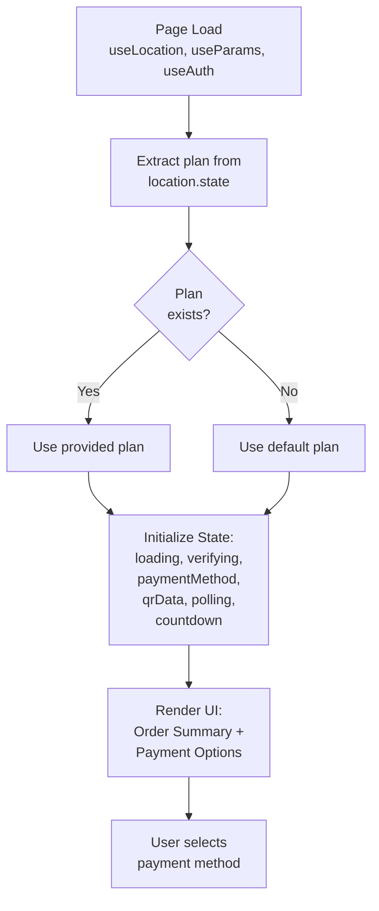

---

## Flow 2: Modal Payment (Cards & NetBanking)

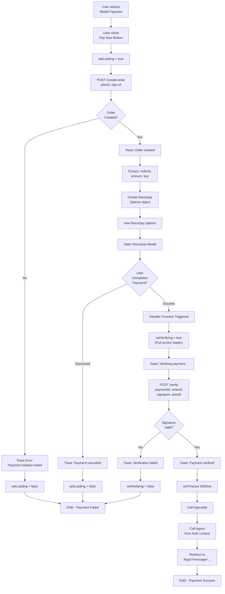

---

## Flow 3: QR Code Payment (UPI)

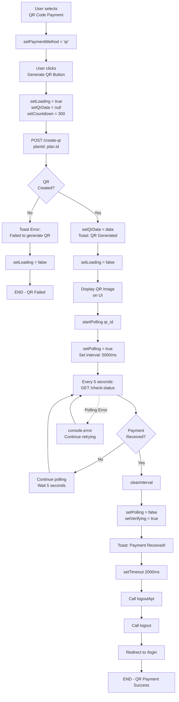

---

## Flow 4: Countdown Timer (QR Code)

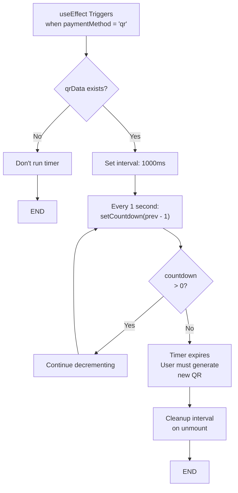

---

## Flow 5: UI State Transitions

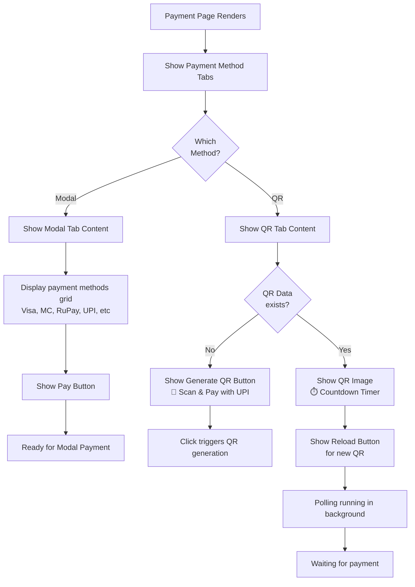

---

## Flow 6: Full Component Lifecycle

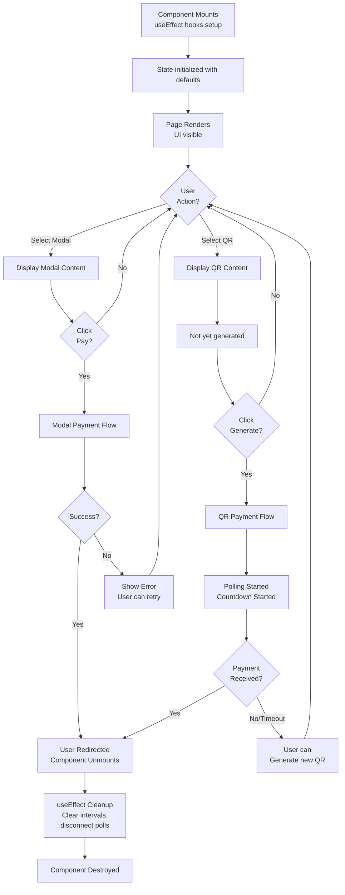

---

## Flow 7: Error Handling & Recovery

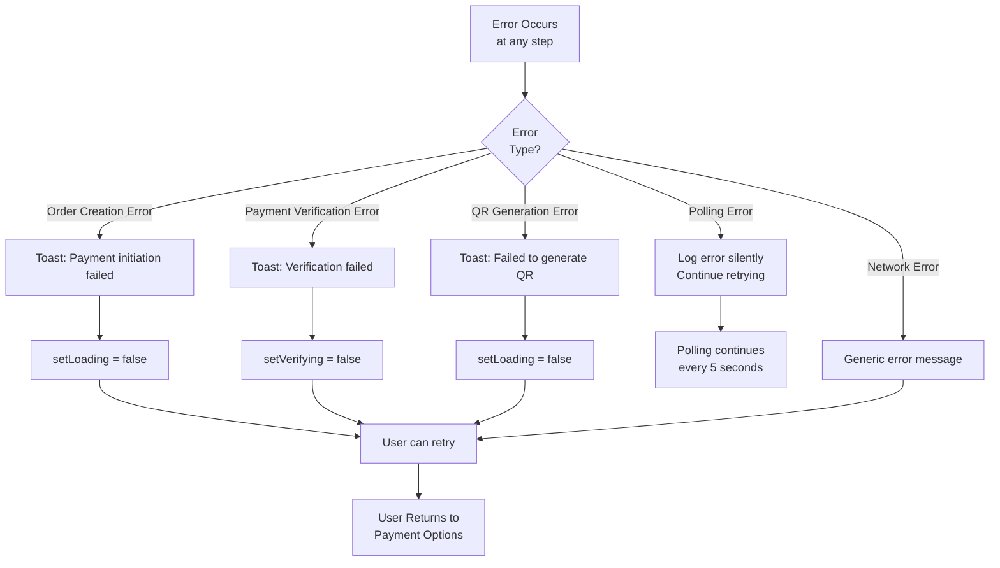

---

## Flow 8: Razorpay Integration

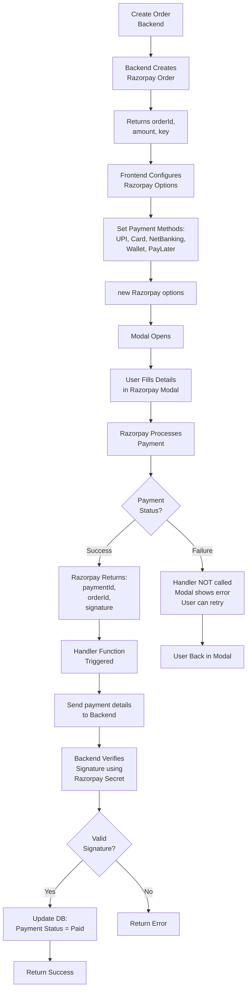

---

## Flow 9: Authentication & Redirect

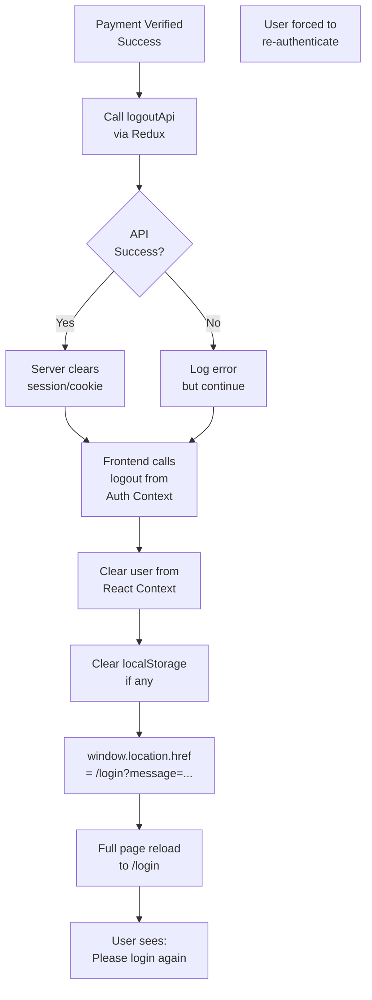

---

## State Dependency Graph

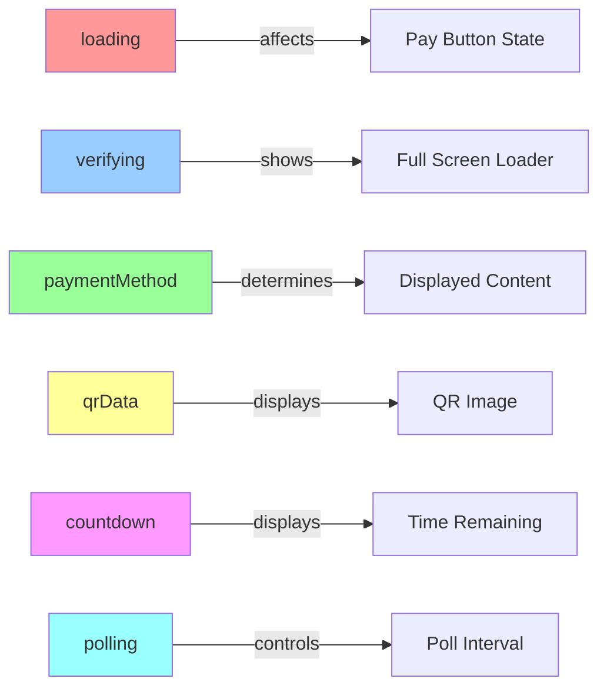

---

## Performance Considerations

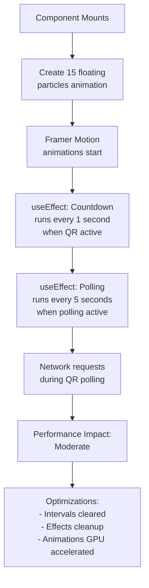

